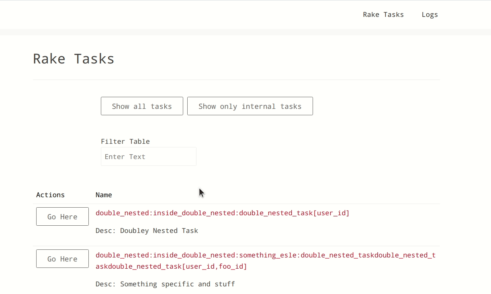

# RakeUi
Rake UI is a Rails engine that enables the discovery and execution rake tasks in a UI.



## Routes

NOTE: Relative to mountpoint in application

 - GET /rake_tasks(.html/.json) - list all available rake tasks
 - GET /rake_tasks/:id(.html/.json) - list info a single tasks
 - POST /rake_tasks/:id/execute - execute a rake task
 - GET /rake_task_logs(.html/.json) - list rake task history
 - GET /rake_task_logs/:id(.html/.json) - list a single rake task history

## Installation
Add this line to your application's Gemfile:

```ruby
gem 'rake-ui'
```

And then execute:
```bash
$ bundle
```

Or install it yourself as:
```bash
$ gem install rake-ui
```

once it is installed, mount the engine
```rb
Rails.application.routes.draw do
  # only mounting when defined will allow us only include in development/test
  if defined? RakeUi::Engine
    mount RakeUi::Engine => "/rake-ui"
  end
end
```

### Storage Backends

RakeUi supports two storage backends for task execution logs: **file** (default) and **database**.

#### File Storage (default)

No additional setup is needed. Task logs are stored as text files in `tmp/rake_ui/` within your Rails application. This is the default behavior.

#### Database Storage

If you prefer to store task logs in your database, run the install generator to create the migration:

```bash
$ rails generate rake_ui:install
```

Then run the migration:

```bash
$ rails db:migrate
```

Finally, configure RakeUi to use the database backend in an initializer:

```rb
# config/initializers/rake_ui.rb
RakeUi.configuration do |config|
  config.storage_backend = :database
end
```


### Configuration

#### Tracking Who Executes Tasks

You can configure RakeUi to track which user executed each task. This is useful for auditing and accountability. Set up a `current_user_method` that returns a user identifier (email, username, etc.):

```rb
# config/initializers/rake_ui.rb
RakeUi.configuration do |config|
  # Proc receives the controller instance and should return a string identifier
  config.current_user_method = ->(controller) { controller.current_user&.email }
  
  # Or with a method name:
  # config.current_user_method = ->(controller) { controller.current_user&.username }
  
  # Or combine multiple fields:
  # config.current_user_method = ->(controller) { 
  #   user = controller.current_user
  #   user ? "#{user.name} (#{user.email})" : nil
  # }
end
```

The user identifier will be:
- Displayed in the "Executed By" column on the logs index page
- Shown in the task info section on the log detail page
- Stored in the log file for each task execution

If not configured, the "Executed By" field will show "Unknown".

#### Securing RakeUi

This tool is built to enable developer productivity in development.  It exposes rake tasks through a UI.

This tool will currently not work in production because we add a guard in the root controller to respond not found if the environment is development or test. You may override this guard clause with the following configuration.

```rb
RakeUi.configuration do |config|
  config.allow_production = true
end
```

We recommend adding guards in your route to ensure that the proper authentication is in place to ensure that users are authenticated so that if this were ever to be rendered in production, you would be covered.  The best way for that is [router constraints](https://guides.rubyonrails.org/routing.html#specifying-constraints)

## Testing

`bundle exec rake test`

To iterate on this fast i normally install nodemon, you can also use guard minitest.

```
# Example with nodemon, you don't have to use this
npm install -g nodemon

# Running a single test whenever models change
nodemon -w ./app/models/*  -e "rb" --exec "rake test TEST=test/rake_ui/rake_task_log_test.rb"
```

## Contributing
See [CONTRIBUTING](./CONTRIBUTING.md)

## License
The gem is available as open source under the terms of the [Apache 2.0 License](./LICENSE).
